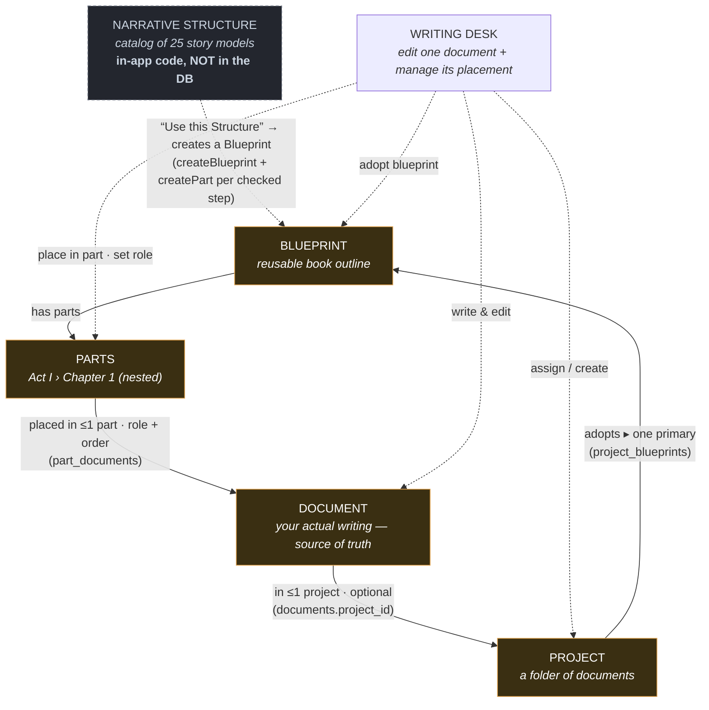

# Writing Nook — Narrative Structure · Blueprints · Projects · Documents (interaction map)

A guide so we don't get lost across **Narrative Structure**, **Blueprints**, **Projects**, and the **Writing Desk**.
Source of truth: the schema (migrations) + Flutter models. Mapped 2026-06-18, **updated 2026-06-19** to add the Narrative Structure tab.

## The one-sentence mental model

> A **Narrative Structure** is a *menu* of story models (Hero's Journey, Save the Cat…). Picking one and choosing its steps **generates a Blueprint**.
> A **Blueprint** is a reusable *book outline* (Parts → Chapters) that a Project *adopts*.
> A **Document** is the atom (your actual writing). A **Project** is a *folder* that groups documents.
> The **Writing Desk** is where you edit **one** document, optionally seeing its project + outline slot.

## The map

Solid arrows = stored data links (foreign keys). Dashed arrows = actions a writer performs.
**Yellow = lives in the database (saved). Grey = in-app only (not saved).**

## What gets saved vs. what's ephemeral  ← (the question this update answers)

| Thing | Where it lives | Persists across restart? |
|-------|----------------|--------------------------|
| The **Narrative Structure catalog** (Hero's Journey, etc.) | hard-coded in `narrative_structures.dart` | n/a — it's code, a fixed menu, never stored per-user |
| **Which N.S. you highlighted** in the list | `selectedStructureIndexProvider` (in-memory, default 0) | ❌ No — resets to the first item |
| **Which steps you checked** before generating | `_selected` set inside `_StructureDetail` (widget state) | ❌ No — resets to "all selected" |
| **The Blueprint you generate** via *Use this Structure* | `blueprints` + `blueprint_parts` rows in the DB, `user_id = you` | ✅ **Yes** — this is the durable artifact |
| **Which Blueprint is selected** in the Blueprints screen | `selectedBlueprintIdProvider` (in-memory, null → auto-selects first) | ❌ No — re-selects the first row each launch |
| A Blueprint **adopted into a Project** | `project_blueprints` (with `is_primary`) | ✅ Yes |
| A Document **placed into a Part** | `part_documents` (role + order) | ✅ Yes |

**Plain-language answer:** picking a Narrative Structure and checking steps saves *nothing* on its own — it's just a live preview. The moment you press **"Use this Structure"**, the chosen steps are written out as a real **Blueprint** (named after the structure) with one **Part/Section** per step. *That* Blueprint is what's saved for the writer, and it shows up in the Blueprints list and survives restarts. The link back to "Hero's Journey" is only the blueprint's name + genre — there's no stored "generated from N.S. X" field.

## Known gap to decide on (the "never without a Project" rule)

Today **"Use this Structure" creates a *standalone* Blueprint** — it is **not** auto-attached to a Project, even though the data model fully supports it (`adoptBlueprint` → `project_blueprints`, primary flag; `part_documents` for docs). The Blueprints screen is global, not project-scoped, so there's no "active project" to adopt into at generation time.

To honor the intended rule ("a writer picks a structure **only inside a Project**"), the next step is one of:

1. **Generate inside a Project context** — reach the N.S. tab from a Project, and on *Use this Structure* call `adoptBlueprint(projectId, newBlueprint.id, isPrimary: true)` right after `createBlueprint`. (Backend already exists; this is additive.)
2. **Prompt for a Project** at generation time if none is active (pick existing or "Create New Project"), then adopt.

Either way the generated Blueprint stops being an orphan and becomes the project's primary outline. **Not yet built — flagged here so we don't forget.**

## The key thing to remember: two *independent* memberships

A document can belong to a project in **two separate ways**, and they do **not** depend on each other:

| # | Membership | How | Meaning |
|---|------------|-----|---------|
| A | **Folder grouping** | `documents.project_id → projects.id` (nullable) | "This doc is filed under this project." Loose, flat. |
| B | **Outline placement** | `documents → part_documents → blueprint_parts` (doc UNIQUE) | "This doc *is* Chapter 3 of the book." Structural, ordered, has a role. |

A document can have **A only**, **B only**, **both**, or **neither**. Don't assume one implies the other — that's the easiest place to get tangled.

## Exact relationships (foreign keys)

- `documents.project_id → projects.id` — **nullable**, `ON DELETE SET NULL`. A document is in **at most one** project.
- `projects.cover_document_id → documents.id` — nullable. A project's cover is one document.
- `project_blueprints (project_id, blueprint_id)` — a project **adopts** blueprints (many-to-many). `UNIQUE(project_id, blueprint_id)`; **at most one** `is_primary` per project.
- `blueprint_parts.parent_part_id → blueprint_parts.id` (composite with `blueprint_id`) — self-nesting tree, **same blueprint only**.
- `part_documents.document_id → documents.id` — **UNIQUE** (a document sits in **at most one** part); carries `role` (Main Content / Supporting / Research / Notes / Reference) + `sort_order`.
- `blueprints.user_id` — **NULL = system template** (read-only), **NOT NULL = user-owned**. `is_system` flag mirrors this.
- **Narrative Structure has no table** — it's a fixed in-app catalog that *produces* `blueprints` rows; it is never itself stored.

## The Writing Desk is the control center (not a dead end)

The Desk doesn't just *display* a document — its right-hand **"Placed in"** pane is where the writer **sets every membership**. From the Desk you can:

- **Assign to / create a Project** → writes `documents.project_id` (and the empty-state offers "Create New Project").
- **Adopt a Blueprint** into the project (`adoptBlueprintFlow` → `project_blueprints`).
- **Place the document in a Part** (part-picker dialog → `part_documents`).
- **Set / change the Role** (Main Content, Supporting, Research, Notes, Reference) and **remove** the placement.
- Jump to `/blueprints` or back to the Project.

So the Desk both *reads* the document content and *writes back* all of its Project/Blueprint/Part/Role associations. That's why the map shows dashed action arrows flowing **out of** the Writing Desk.

## The intended writer flow

1. **Create a Project** (the book / body of work).
2. **Choose a structure** — either pick a **Narrative Structure** (Hero's Journey…) and *Use this Structure* to generate a Blueprint, or adopt an existing **Blueprint** (system template or your own). One is the *primary*.
3. **Place Documents into the Blueprint's Parts** — "Chapter 1 = this draft," with a role + order.
4. **Open a Document in the Writing Desk** to write it — the left pane shows where it sits (project + part).

## Navigation edges (today)

- **Blueprints** (`/blueprints`) — two tabs: **Book Structure** (list + tree editor of blueprint structure) and **Narrative Structure** (catalog → *Use this Structure* → generates a Blueprint). Independent of any project today.
- **Projects** (`/projects`) → tap a card → **Project Detail** (`/projects/:id`) — tabs: Overview, Documents, Blueprints, Activity.
- **Project Detail → Writing Desk** (`/writing-desk/:docId?projectId=:id`) — opens a doc *with* project context.
- **Library → Writing Desk** (`/writing-desk/:docId`) — opens a doc with **no** project context (`projectId` absent).
- **Writing Desk** left pane → breadcrumb back to **Project Detail** (only if `projectId` present).

## Decoupled by design (don't "fix" these)

- A **Project can exist with no Blueprint**; a **Blueprint can exist with no Project** (it's a template or, today, a freshly generated structure).
- **Documents and Blueprints have no direct FK** — the only link is `part_documents` (a document must be *explicitly placed* in a part).
- **Library shows all documents**; an unfiled document (no `project_id`, no part) still appears there.
- The **Writing Desk acts on one document**; it does *not* edit blueprint structure (that's the Blueprints screen).

---
_Remodel guide. Stored entities: `documents`, `projects`, `blueprints`, `blueprint_parts`, `project_blueprints`, `part_documents`. Narrative Structure is in-app catalog data (`narrative_structures.dart`), not a table._
